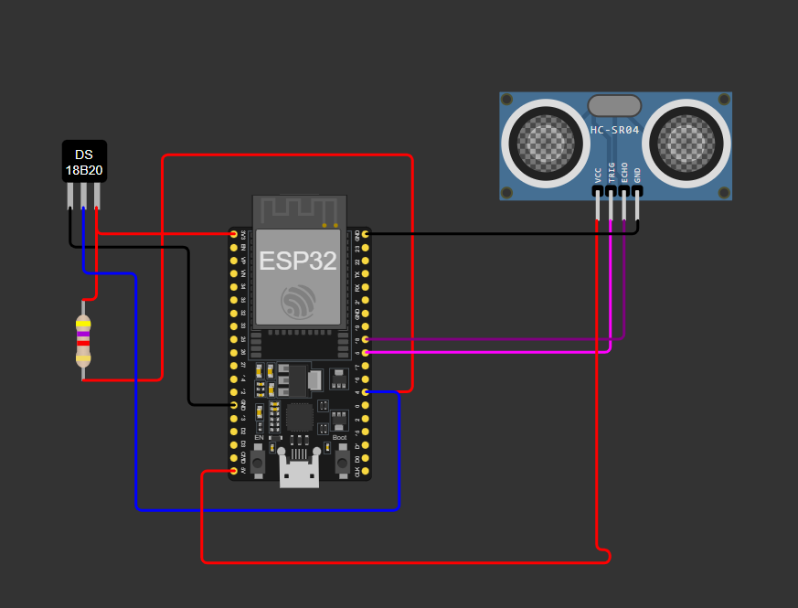
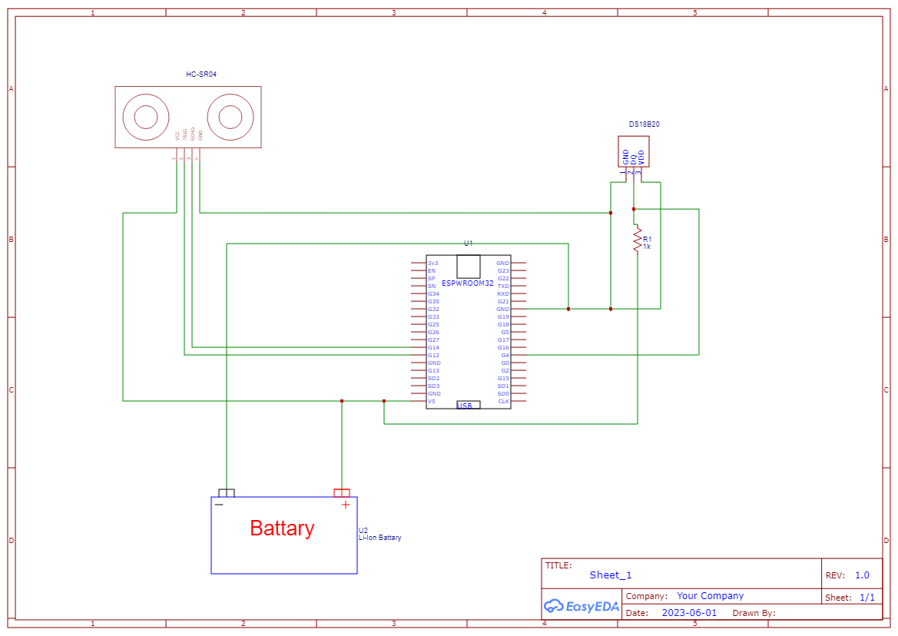

# 🧊 Remote Monitoring of Coke Cans in a Fridge using ESP32 and MQTT

[](https://www.arduino.cc/) 
[](https://nodered.org/) 
[](https://mosquitto.org/) 
[](https://wokwi.com/)

**ESP32 • DS18B20 Temperature Sensor • Ultrasonic Sensor • MQTT (Mosquitto) • Node-RED Dashboard**

This IoT project monitors the **temperature** and **remaining Coke cans** inside a fridge using an **ESP32**, displaying live data on a **Node-RED dashboard**. It's ideal for learning MQTT communication, sensor integration, and creating dashboards for real-time monitoring.

---

## 📌 Features

- Real-time fridge **temperature monitoring**  
- **Ultrasonic level reading** to measure remaining cans  
- Automatic calculation of **Coke can count**  
- Communication via **MQTT using Mosquitto Broker**  
- Interactive **Node-RED Dashboard** for live visualization  
- Works with **Wokwi simulation** or physical hardware  
- Easy to extend for other beverages or smart fridge applications  

---

## 🛠 Hardware Components

| Component | Quantity | Purpose |
|-----------|----------|---------|
| ESP32 Dev Board | 1 | Main controller |
| DS18B20 Digital Temperature Sensor | 1 | Fridge temperature |
| HC-SR04 Ultrasonic Sensor | 1 | Measure can height (stock level) |
| 4.7kΩ resistor | 1 | Pull-up resistor for DS18B20 |
| Jumper wires | — | Connections |
| USB cable | 1 | Power & programming |

---

## 🔌 Wiring Diagram

### DS18B20 Connections
| DS18B20 | ESP32 |
|---------|--------|
| VDD     | 3.3V   |
| GND     | GND    |
| DATA    | GPIO 4 |
**Note:** 4.7kΩ resistor between DATA ↔ 3.3V  

### HC-SR04 Connections
| HC-SR04 | ESP32 |
|---------|--------|
| VCC     | 5V     |
| GND     | GND    |
| TRIG    | GPIO 13 |
| ECHO    | GPIO 12 |

- Wiring diagram:   
- Schematic:   

---

## 💻 Software Setup

1. **Arduino IDE / PlatformIO**  
   - Install **ESP32 board support**  
   - Install libraries: `OneWire`, `DallasTemperature`, `PubSubClient`  
   - Open [`esp32_fridge_monitor.ino`](./esp32_fridge_monitor.ino) and configure:
   ```cpp
   const char* ssid = "YOUR_WIFI_SSID";
   const char* password = "YOUR_WIFI_PASSWORD";
   const char* mqtt_server = "BROKER_IP_OR_HOSTNAME";


